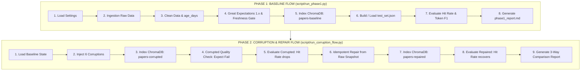

# KẾ HOẠCH THỰC THI CHI TIẾT DÀNH CHO VAI TRÒ LEAD
## Pipeline Lead & System Integrator — Day 10 Lab

> **Vai trò:** Trưởng nhóm & Kỹ sư Điều phối Tích hợp Hệ thống (Pipeline Lead & System Integrator)  
> **Trách nhiệm cốt lõi:**  
> 1. Thiết lập nền tảng dự án, quản trị cấu hình (`src/core/`) và môi trường thực thi.  
> 2. Lập trình 2 pipeline trung tâm: **Phase 1 Baseline Pipeline** (`src/pipelines/phase1.py`) và **Phase 2 Corruption & Repair Flow** (`src/pipelines/corruption_flow.py`).  
> 3. Tích hợp các module độc lập của thành viên nhóm, kiểm thử end-to-end không phát sinh lỗi.  
> 4. Quản lý tiến độ theo 7 Checkpoints, quản trị Git, nghiệm thu báo cáo nhóm và bảo vệ Live Demo.

---

## 1. TỔNG QUAN LUỒNG ĐIỀU PHỐI CỦA LEAD

Pipeline Lead là "nhạc trưởng" kết nối công việc của cả 3 kỹ sư thành viên:
- **Từ Kỹ sư Dữ liệu (TV2):** Nhận `fetch_source_records`, `build_clean_dataframe`, `corrupt_clean_dataframe`.
- **Từ Kỹ sư RAG (TV3):** Nhận `LocalEmbeddingIndex`, `build_agent`, `answer_question`.
- **Từ Kỹ sư Observability (TV4):** Nhận `run_data_quality_checks`, `build_freshness_report`, `build_test_set`, `generate_phase1_report`, `generate_corruption_report`.



---

## 2. KẾ HOẠCH TRIỂN KHAI TỪNG GIAI ĐOẠN (STAGE-BY-STAGE ACTION PLAN)

---

### GIAI ĐOẠN 0: THIẾT LẬP NỀN TẢNG & KIỂM TRA MÔI TRƯỜNG (Checkpoints 0)
**Thời lượng dự kiến:** 20 - 30 phút  
**Trọng tâm:** Đảm bảo toàn bộ workspace hoạt động trơn tru, không có lỗi cấu hình hay thiếu thư viện.

#### Các bước hành động:
1. **Kiểm tra môi trường ảo và dependencies:**
   - Xác nhận Python version $\ge 3.11$.
   - Kích hoạt `.venv` và kiểm tra 3 thư viện then chốt: `chromadb`, `great_expectations`, `sentence_transformers`.
2. **Kiểm tra và chuẩn hóa cấu hình (`src/core/config.py`):**
   - Đảm bảo hàm `load_settings()` tự động nhận diện đúng root directory của dự án và nạp file `.env`.
   - Kiểm tra các path trong `Paths` trỏ đúng vào thư mục `data/` (`raw`, `clean`, `chroma`, `eval`, `quality`, `results`, `reports`).
3. **Kiểm tra bộ dữ liệu mẫu (Offline Fallback Artifacts):**
   - Xác minh file `data/raw/crossref_response.json` đã có sẵn và hợp lệ (chứa 24 items).
4. **Phân nhánh Git & Khởi tạo cấu trúc:**
   - Tạo nhánh `feat/lead-pipeline-integration` để làm việc.
   - Nhắc nhở 3 thành viên checkout đúng branch của họ (`feat/data-foundation`, `feat/rag-vector`, `feat/observability-eval`).

#### Tiêu chí nghiệm thu (Acceptance Criteria):
- [ ] Console in ra `Môi trường sẵn sàng`.
- [ ] Lệnh kiểm tra settings chạy thành công:
  ```bash
  python -c "from core.config import load_settings; s=load_settings(); print(s.paths.project_dir)"
  ```

---

### GIAI ĐOẠN 1: TRIỂN KHAI BASELINE PIPELINE (`src/pipelines/phase1.py`) (Checkpoints 1 - 3)
**Thời lượng dự kiến:** 45 - 60 phút  
**Trọng tâm:** Xây dựng hàm `main()` trong `src/pipelines/phase1.py` để chạy trọn vẹn luồng dữ liệu sạch từ A đến Z.

#### Các bước hành động chi tiết:
1. **Bóc tách và phối hợp các mắt xích của Phase 1:**
   - **Bước 1.1:** Khởi tạo `settings = load_settings()`.
   - **Bước 1.2:** Ingestion dữ liệu:
     ```python
     records = fetch_source_records(settings)
     ```
   - **Bước 1.3:** Làm sạch dữ liệu và bảo toàn snapshot sạch:
     ```python
     clean_df = build_clean_dataframe(records, run_date=datetime.now(timezone.utc))
     # Lưu ra data/clean/papers_clean.csv và papers_clean.json
     ```
   - **Bước 1.4:** Chốt kiểm dịch Data Quality Gate (GX 1.x) & Freshness SLA:
     ```python
     quality_res = run_data_quality_checks(clean_df, settings, report_name="baseline")
     freshness_res = build_freshness_report(clean_df, settings, settings.paths.freshness_report)
     ```
   - **Bước 1.5:** Xây dựng Vector Index ChromaDB:
     ```python
     index = LocalEmbeddingIndex.build(clean_df, settings, settings.paths.embeddings_json)
     ```
   - **Bước 1.6:** Chuẩn bị bộ đề thi Benchmark (10 câu):
     ```python
     test_set = build_test_set(clean_df, settings.paths.eval_testset)
     ```
   - **Bước 1.7:** Đánh giá RAG (Retrieval Hit Rate & Token F1):
     ```python
     eval_bundle = evaluate_index(settings, index, test_set, settings.paths.baseline_answers)
     write_json(settings.paths.baseline_metrics, eval_bundle.summary)
     ```
   - **Bước 1.8:** Sinh báo cáo Baseline Markdown:
     ```python
     generate_phase1_report(
         report_path=settings.paths.baseline_report,
         source_summary={"total_records": len(records)},
         metrics=eval_bundle.summary,
         quality=quality_res,
         freshness=freshness_res,
     )
     ```
2. **Kiểm tra Entrypoint `script/run_phase1.py`:**
   - Đảm bảo gọi đúng `from pipelines.phase1 import main; main()`.

#### Tiêu chí nghiệm thu (Acceptance Criteria):
- [ ] Chạy lệnh `python script/run_phase1.py` thoát với Exit Code 0.
- [ ] Sinh đủ 4 artifacts bắt buộc:
  - `data/clean/papers_clean.csv` (24 dòng sạch)
  - `data/eval/test_set.json` (10 câu hỏi)
  - `data/results/baseline_metrics.json` (`retrieval_hit_rate > 0.7`)
  - `data/reports/phase1_report.md` (đầy đủ nội dung)

---

### GIAI ĐOẠN 2: TRIỂN KHAI CORRUPTION & IDEMPOTENT REPAIR FLOW (`src/pipelines/corruption_flow.py`) (Checkpoints 4 - 5)
**Thời lượng dự kiến:** 45 - 60 phút  
**Trọng tâm:** Xây dựng quy trình chứng minh Silent Failure bằng cách tiêm lỗi $\rightarrow$ đo sụt giảm $\rightarrow$ tự động hồi phục Idempotent từ Raw.

#### Các bước hành động chi tiết:
1. **Lập trình luồng tiêm lỗi (Corruption Step):**
   - Đọc dữ liệu sạch `papers_clean.csv`.
   - Gọi hàm tiêm lỗi `corrupt_clean_dataframe(clean_df, settings.paths.corruption_log)`.
   - Lưu DataFrame lỗi vào `settings.paths.corrupted_clean_csv` và `.json`.
   - Dựng index ChromaDB riêng biệt cho dữ liệu bẩn:
     ```python
     corrupted_index = LocalEmbeddingIndex.build(
         corrupted_df, settings, settings.paths.corrupted_embeddings_json
     )
     ```
2. **Đo lường suy giảm & Chứng minh Quality Gate báo động:**
   - Chạy kiểm tra Quality Gate trên dữ liệu lỗi:
     ```python
     corrupted_quality = run_data_quality_checks(corrupted_df, settings, report_name="corrupted")
     # Kỳ vọng: corrupted_quality["success"] == False
     ```
   - Chạy đánh giá trên cùng bộ 10 câu `test_set.json`:
     ```python
     corrupted_eval = evaluate_index(settings, corrupted_index, test_set, settings.paths.corrupted_answers)
     write_json(settings.paths.corrupted_metrics, corrupted_eval.summary)
     ```
   - Ghi nhận hiện tượng **Silent Failure**: AI không báo lỗi exception nhưng Hit Rate và Token F1 bị giảm sút nghiêm trọng.
3. **Thực thi phục hồi an toàn (Idempotent Repair Step):**
   - Đọc lại bản nguyên gốc từ `data/raw/crossref_records.json` (hoặc `crossref_response.json`).
   - Tái thực hiện quy trình `build_clean_dataframe()` mà không can thiệp thủ công.
   - Lưu ra `settings.paths.repaired_clean_csv` và `.json`.
   - Dựng index ChromaDB cho collection phục hồi:
     ```python
     repaired_index = LocalEmbeddingIndex.build(
         repaired_df, settings, settings.paths.repaired_embeddings_json
     )
     ```
   - Đánh giá lại:
     ```python
     repaired_eval = evaluate_index(settings, repaired_index, test_set, settings.paths.repaired_answers)
     write_json(settings.paths.repaired_metrics, repaired_eval.summary)
     ```
4. **Xuất báo cáo đối chiếu định lượng 3 trạng thái:**
   - Gọi hàm sinh báo cáo:
     ```python
     generate_corruption_report(
         report_path=settings.paths.comparison_report,
         baseline_metrics=baseline_metrics,
         corrupted_metrics=corrupted_eval.summary,
         repaired_metrics=repaired_eval.summary,
         corrupted_quality=corrupted_quality,
         repaired_quality=repaired_quality,
         corrupted_freshness=corrupted_freshness,
         repaired_freshness=repaired_freshness,
     )
     ```

#### Tiêu chí nghiệm thu (Acceptance Criteria):
- [ ] Lệnh `python script/run_corruption_flow.py` chạy thành công không crash.
- [ ] File `data/results/corruption_log.json` ghi nhận đủ 6 kịch bản lỗi.
- [ ] `corrupted_metrics.json` chứng minh sụt giảm rõ rệt so với baseline.
- [ ] `repaired_metrics.json` chứng minh chỉ số phục hồi trở lại mức baseline.
- [ ] `data/reports/corruption_report.md` có bảng đối chiếu 3 cột rõ ràng: **Baseline vs Corrupted vs Repaired**.

---

### GIAI ĐOẠN 3: TỔNG TÍCH HỢP, CODE REVIEW & CHUẨN BỊ LIVE DEMO (Checkpoints 6)
**Thời lượng dự kiến:** 30 - 45 phút  
**Trọng tâm:** Rà soát toàn bộ dự án, hợp nhất code vào nhánh `main`, đảm bảo 100% tiêu chí chấm điểm và chuẩn bị demo thuyết phục.

#### Các bước hành động chi tiết:
1. **Hợp nhất Git & Kiểm tra Contributor:**
   - Tạo Pull Request từ các nhánh thành viên vào `main`.
   - Giải quyết xung đột (nếu có - theo nguyên tắc phân quyền file đã định).
   - Truy cập GitHub repository $\rightarrow$ vào mục **Insights > Contributors**:
     > ⚠️ Bắt buộc 100% 4 thành viên trong nhóm đều phải xuất hiện trên biểu đồ commit của nhánh `main`!
2. **Kiểm tra tính Idempotent (Chạy lại từ đầu không lỗi):**
   - Xóa các thư mục tạm (`data/chroma`, `data/results`) và chạy lại tuần tự 2 script:
     ```bash
     python script/run_phase1.py
     python script/run_corruption_flow.py
     ```
   - Đảm bảo kết quả nhất quán 100%.
3. **Hoàn thiện hồ sơ báo cáo:**
   - Cập nhật thông tin nhóm, phân công và tự khai trong `docs/TEAM.md`.
   - Viết tổng kết báo cáo nhóm `report/group_report.md`.
   - Kiểm tra mỗi thành viên đã có file báo cáo cá nhân `report/<MSSV>_HoTen.md`.
4. **Kịch bản Live Demo trên bảng (3 - 5 phút):**
   - **Phút 1:** Giới thiệu bài toán và luồng Data Pipeline 7 tầng.
   - **Phút 2:** Mở `data/reports/corruption_report.md` chỉ rõ hiện tượng Silent Failure (Agent vẫn nói hay nhưng trả lời sai do dữ liệu lỗi).
   - **Phút 3:** Trình diễn kết quả phục hồi Idempotent Repair (AI lấy lại phong độ 100%).
   - **Phút 4-5:** Trả lời chất vấn của Giảng viên về Great Expectations 1.x và Freshness SLA.
5. **Nộp bài VLearn LMS:**
   - Nhắc nhở và giám sát từng thành viên nộp link repo lên VLearn LMS trước 23:59:59.

---

## 3. CHECKLIST KIỂM TOÁN CHẤT LƯỢNG CỦA LEAD (QA AUDIT CHECKLIST)

| Hạng mục kiểm tra | Lệnh hoặc Vị trí kiểm tra | Kết quả mong đợi | Xác nhận |
| :--- | :--- | :--- | :---: |
| **Môi trường** | `python -c "import chromadb, great_expectations, sentence_transformers; print('OK')"` | In ra `OK` | 🔲 |
| **Phase 1 Script** | `python script/run_phase1.py` | Exit code 0, sinh đủ 4 file | 🔲 |
| **Phase 2 Script** | `python script/run_corruption_flow.py` | Exit code 0, in bảng 3 trạng thái | 🔲 |
| **Data Quality Gate** | `data/quality/corrupted_quality_report.json` | Bắt được vi phạm (`success=False`) | 🔲 |
| **Freshness SLA** | `data/quality/freshness_report.json` | Có trường `is_fresh` & tỷ lệ quá hạn | 🔲 |
| **ChromaDB Collections** | `data/chroma/` | Tồn tại 3 collection tách biệt | 🔲 |
| **Bảo mật Secret** | `git status` & Git log | Tuyệt đối không commit file `.env` | 🔲 |
| **Báo cáo đối chiếu** | `data/reports/corruption_report.md` | Bảng 3 cột: Baseline, Corrupted, Repaired | 🔲 |
| **Báo cáo nhóm & cá nhân**| `docs/TEAM.md`, `report/group_report.md`, `report/*.md` | Đầy đủ thông tin cả 4 người | 🔲 |
| **GitHub Contributor** | GitHub Web: `Insights > Contributors` | 100% 4/4 thành viên có commit nhánh `main` | 🔲 |
| **Nộp bài VLearn LMS** | Cổng LMS cá nhân | Cả 4 người đã bấm Submit link | 🔲 |

---

## 4. CHIẾN THUẬT PHÒNG NGỪA RỦI RO (RISK MANAGEMENT)

| Rủi ro tiềm ẩn | Mức độ | Biện pháp xử lý tức thời của Lead |
| :--- | :---: | :--- |
| API Crossref bị `429 Too Many Requests` hoặc rớt mạng phòng lab | Cao | Tự động kích hoạt cơ chế Offline Fallback: nạp trực tiếp từ `data/raw/crossref_response.json` có sẵn. |
| Thành viên bị tắc nghẽn (Blocker) ở phần code của họ | Trung bình | Kích hoạt stub/mock function tạm thời trong pipeline để tiếp tục luồng, hỗ trợ thành viên gỡ rối. |
| Merge conflict trên Git khi hợp nhất nhánh | Thấp | Nhóm đã áp dụng File Ownership Matrix độc quyền; nếu conflict ở `phase1.py`, Lead là người duy nhất resolve. |
| Rò rỉ API Key lên Git | Cực cao | Kiểm tra `.gitignore` trước mọi commit; nếu phát sinh, dùng `git filter-repo` xóa ngay và rotate key mới. |
| Hết giờ trước khi kịp nộp bài | Cao | Đúng phút 210, dừng toàn bộ việc thêm tính năng mới, tập trung 100% cho việc commit, test script và nộp link LMS. |
